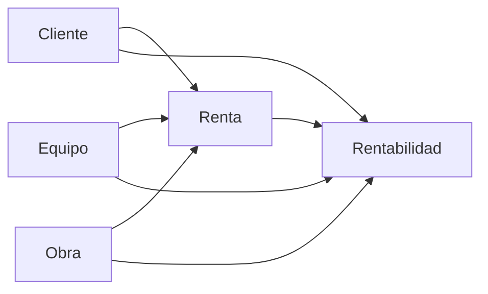
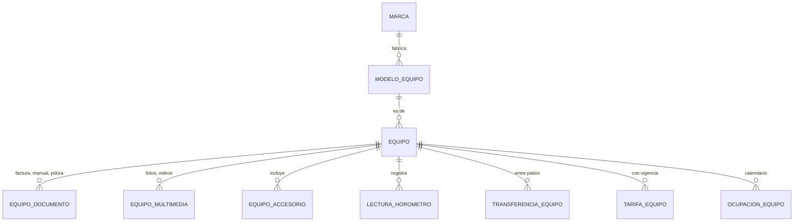
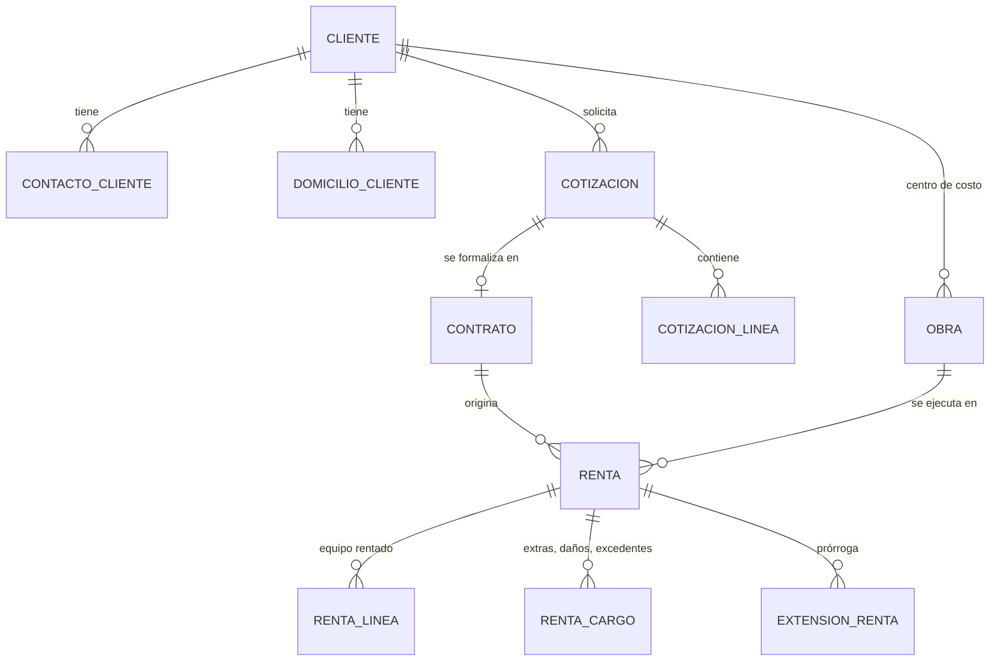
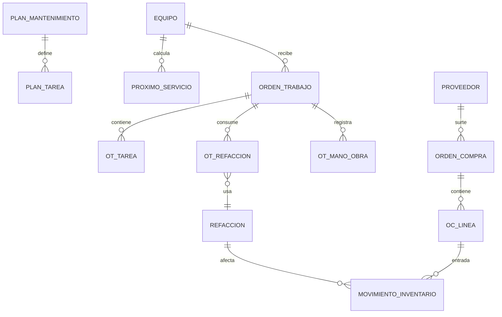

# Modelo de datos conceptual

> Entidades y relaciones de los 26 módulos, a nivel conceptual (sin columnas de detalle).
> El propósito es **no encajonarse**: identificar hoy las decisiones transversales que, si se descubren en la Fase 3, obligan a migrar la Fase 1.
>
> Total aproximado: **75 entidades**. Esto es un ERP vertical, no un CRUD.

---

## 1. El eje del modelo

El documento lo dice con claridad: *"el equipo será el eje central de la información"*. Pero operativamente hay **dos** ejes que se cruzan:



**Equipo** acumula la historia física y de costos. **Renta** es la transacción que conecta todo. Casi toda la información económica del sistema es una arista entre estos dos.

---

## 2. Decisiones estructurales

Cinco decisiones que definen el modelo. Cada una resuelve un problema que, mal resuelto, cuesta una reescritura.

### 2.1 Calendario unificado de ocupación

**Problema.** La regla más importante del sistema es *"un equipo no puede tener dos rentas que se traslapen"*, y el módulo 3 dice que la disponibilidad debe consultar *"rentas, reservas, mantenimiento, bloqueos y traslados"*. La solución ingenua es consultar cinco tablas y cruzar los rangos en C#. Eso es lento, se vuelve inconsistente bajo concurrencia, y en algún momento **va a permitir una doble asignación** — dos usuarios reservando el mismo equipo al mismo tiempo es una condición de carrera clásica que ninguna validación en código resuelve.

**Solución.** Una sola tabla `ocupacion_equipo` que representa el calendario físico del equipo. Rentas, reservas, órdenes de trabajo, traslados y bloqueos manuales **insertan una fila** en ella:

| Campo | Tipo |
|---|---|
| `id` | uuid |
| `equipo_id` | uuid |
| `periodo` | `tstzrange` |
| `motivo` | enum: `Renta`, `Reserva`, `Mantenimiento`, `Traslado`, `Bloqueo` |
| `referencia_id` | uuid (a la renta, orden de trabajo, etc.) |
| `activo` | boolean |

Y la garantía la da el motor, no la aplicación:

```sql
CREATE EXTENSION IF NOT EXISTS btree_gist;

ALTER TABLE ocupacion_equipo
ADD CONSTRAINT ocupacion_sin_traslape
EXCLUDE USING gist (
    equipo_id                 WITH =,
    tstzrange(inicio, fin)    WITH &&
) WHERE (activo);
```

Dos notas sobre esta forma:

- **No lleva `tenant_id`** porque cada empresa tiene su propia base de datos: dentro de ella, `equipo_id` ya identifica sin ambigüedad.
- **Guarda `inicio` y `fin` como dos columnas**, no una columna `tstzrange`. El tipo de rango solo se mapea en C# con `NpgsqlRange<T>`, de la librería Npgsql, y `Maquinaria.Dominio` no depende de infraestructura. Los constraints `EXCLUDE` aceptan expresiones, así que `tstzrange(inicio, fin)` es equivalente.

Con esto:
- La doble asignación es **imposible**, incluso con dos transacciones simultáneas. Postgres rechaza el insert.
- La consulta de disponibilidad es una sola query con índice GiST, no cinco joins.
- Las reglas "un equipo en mantenimiento no puede estar disponible" y "un equipo fuera de servicio no puede rentarse" salen gratis: son filas de ocupación.
- "Una extensión vuelve a verificar disponibilidad" se convierte en un `UPDATE` del rango que el constraint valida solo.

Esta es, por sí sola, la razón técnica más fuerte para haber elegido PostgreSQL. **No implementar esta regla en código de aplicación.**

### 2.2 La subrenta no es una entidad aparte

**Problema.** El módulo 30 permite rentar al cliente un equipo que la empresa no posee. Si se modela como una tabla `equipo_subrentado` separada, hay que duplicar inspecciones, fletes, evidencias, horómetros y contratos para ambos tipos. Es el doble de código y el doble de bugs.

**Solución.** `Equipo` gana dos campos: `origen` (`Propio` | `Subrentado`) y `proveedor_id` (nullable). Un equipo subrentado es un equipo normal que:
- pertenece a un proveedor,
- tiene un **costo** de subrenta además del precio al cliente,
- no genera depreciación ni valor de activo.

Todo el resto del sistema —inspecciones, fletes, expediente, historial, QR— funciona sin cambios. El margen de la subrenta es `precio_cliente − costo_proveedor`, igual que el margen del flete.

### 2.3 Evidencias polimórficas

**Problema.** El módulo 11 exige asociar fotos, videos, documentos y firmas a siete tipos de evento distintos (alta, entrega, devolución, mantenimiento, daño, flete, inspección). Siete tablas de evidencias es inmantenible; siete columnas FK nullable en una sola tabla es peor.

**Solución.** Una tabla `evidencia` con referencia polimórfica: `tipo_entidad` (enum) + `entidad_id` (uuid), más los metadatos que pide el documento (archivo, fecha, hora, usuario, ubicación GPS, evento, comentario).

Se pierde la integridad referencial declarativa. Se compensa con:
- índice compuesto en `(tipo_entidad, entidad_id)`,
- un enum estricto en `tipo_entidad` (no texto libre),
- una prueba de integridad que corre en CI y detecta huérfanos.

Es el intercambio correcto: siete tablas casi idénticas tienen un costo de mantenimiento permanente, mientras que el riesgo del huérfano es acotado y detectable.

### 2.4 Obra es una entidad de primer nivel

La "obra" aparece en cotizaciones, contratos, rentas, logística y en tres reportes de rentabilidad, pero **el documento no le dedica un módulo**. Es un hueco de la especificación, no una entidad menor: es el centro de costo del cliente y el documento dice explícitamente que *"todas las operaciones económicas relacionadas deben acumularse en el centro de costo correspondiente"*.

`Obra` pertenece a un `Cliente`, tiene domicilio y coordenadas (las necesita la logística para las rutas), fechas de inicio y fin estimado, un contacto en sitio, y acumula rentas.

### 2.5 Tarifas: entidad propia, no columnas en Equipo

El módulo 2 lista *"tarifas por hora, día, semana y mes"* como si fueran cuatro columnas de `Equipo`. No lo son, porque:
- cambian con el tiempo y hay que conservar la histórica (una renta de marzo se cobró a la tarifa de marzo),
- un cliente grande negocia tarifas propias,
- hay tarifas por temporada y por volumen.

`TarifaEquipo` es una entidad con vigencia (`tstzrange`), opcionalmente ligada a un cliente, y la renta **congela** la tarifa aplicada en su propia línea. Nunca se lee la tarifa vigente para recalcular una renta pasada.

---

## 3. Entidades por área

### Plataforma (SaaS) — *no está en la especificación*

| Entidad | Notas |
|---|---|
| `Tenant` | Empresa suscrita. Razón social, RFC, subdominio, estado, zona horaria, moneda |
| `Plan` | Básico / Profesional / Enterprise |
| `Modulo` | Catálogo de los módulos del producto. **Es la unidad con la que se define un plan** |
| `PlanModulo` | Qué módulos incluye cada plan. Llave compuesta, sin `id` propio |
| `TipoLimite` | Catálogo de tipos de cupo: equipos, usuarios, sucursales, almacenamiento GB. Trae `valor_defecto` |
| `TenantLimite` | El cupo **por empresa**. Tabla dispersa: solo excepciones al valor por defecto |
| ~~`PlanLimite`~~ | **No existe.** Los cupos cuelgan del tenant, no del plan: un cliente que negocia 300 equipos con un plan de 200 no obliga a inventarle un plan a medida |
| `Suscripcion` | Tenant + plan + vigencia + estado (prueba, activa, suspendida, cancelada) |
| ~~`ConsumoTenant`~~ | **No es tabla, y no está en la Fase 0.** El consumo se *calcula*: almacenamiento con `SUM(archivo.tamano_bytes)`, usuarios y equipos contando filas. Una tabla de acumulados solo se justifica cuando esos conteos se vuelvan caros o cuando haya que facturar por consumo histórico |
| `Usuario` | Superadministradores (nosotros). Tabla `usuario` de la base **central**, homónima y separada a propósito de la `usuario` de cada base de empresa |
| `Auditoria` | La bitácora de la plataforma: altas y bajas de tenants, cambios de plan, movimientos de límites. **La misma entidad se usa en los dos contextos** — no tiene relaciones, así que no hay razón para duplicar la clase |

### Configuración y seguridad — M24, M25, auditoría

`Sucursal`, `Patio`, `Usuario`, `TokenAcceso`, `SesionRefresh`, `Rol`, `Permiso`, `RolPermiso`, `UsuarioRol`, `Parametro`, `Auditoria`

> `Usuario` **no se borra**: vive en un `estado` (`Invitado`, `Activo`, `Suspendido`, `Baja`). Y `Rol` lleva dos banderas distintas: `es_sistema`, que solo impide borrarlo, y `acceso_total`, que salta la verificación de permisos y va únicamente en `administrador`.

> **No existe una entidad `Empresa` aparte.** Los datos de la empresa —razón social, RFC, zona horaria, moneda— viven en `Tenant`. Son la misma cosa vista desde dos ángulos: `Tenant` es "el cliente que nos paga la suscripción" y también "la empresa cuya operación administra el sistema". Separarlas obligaría a mantener dos tablas 1:1 con los mismos campos.

### Catálogos — globales + extensión por tenant

`CategoriaEquipo`, `TipoEquipo`, `Marca`, `ModeloEquipo`, `UnidadMedida`, `Moneda`, `TipoDocumento`, `Accesorio`

### Activos — M2, M12, M24, M29



`Equipo` — estados: `Disponible`, `Reservado`, `Rentado`, `EnTransito`, `Mantenimiento`, `FueraDeServicio`, `Baja`.

> **Un solo ciclo de vida, que puede terminar en venta.** Decidido el 2026-08-21: el equipo se renta durante años y al final **se vende**, así que no hay dos parques separados —uno de renta y otro de venta— sino una sola entidad con una vida larga. La venta será el motivo de su `Baja`, y tendrá que cerrar su calendario de ocupación para que no pueda rentarse después.
>
> **No se construye todavía.** Se evaluó ampliar el primer entregable a venta y compra de equipos y se decidió **acotarlo a rentas**. Lo que esta nota preserva es la decisión estructural, que es la cara: separar los parques desde el alta habría sido una reescritura, mientras que agregar un motivo de baja y un documento de venta sobre esta forma es aditivo.
El QR no es una tabla: es un `token_qr` único en `Equipo`.

### Comercial — M4, M5, M6, M7



`Cliente` incluye el "semáforo": una clasificación **calculada**, no capturada (puntualidad, saldo, daños, extensiones, historial de pago).

`Renta` — estados del documento: `Borrador`, `Reservada`, `Preparacion`, `EnEntrega`, `Activa`, `EnDevolucion`, `EnInspeccion`, `PendienteCargos`, `Cerrada`, `Cancelada`. Es una máquina de estados y debe implementarse como tal, con transiciones válidas explícitas.

`RentaLinea` es importante: una renta puede llevar **varios equipos**. El documento habla de "equipo" en singular, pero en la práctica un cliente renta una excavadora, un compactador y dos generadores en un solo contrato. Modelar 1:1 renta–equipo es un error que se paga caro.

### Logística — M8

`Flete`, `Vehiculo`, `Operador`, `Ruta`. `Flete` guarda **precio cobrado y costo real** por separado (el documento lo pide explícitamente) para calcular margen.

### Campo e inspecciones — M9, M10, M11

`PlantillaInspeccion`, `PlantillaInspeccionItem`, `Inspeccion` (tipo: `Salida` | `Devolucion`), `InspeccionItem`, `Dano`, `Evidencia`, `Firma`

Las plantillas son configurables por tenant y por categoría de equipo: el checklist de una excavadora no es el de un generador. `Dano` distingue `Preexistente` de `Nuevo` (regla de negocio del documento) y la inspección de devolución se compara contra la de salida de la misma renta.

### Taller — M13 a M18



`PlanMantenimiento` soporta los cuatro disparadores del documento: fecha, horómetro, kilometraje y condición. `ProximoServicio` es derivado (recalculado con cada lectura de horómetro), no capturado.

`MovimientoInventario` es la única forma de alterar existencias — nunca un `UPDATE` directo al stock. La existencia es la suma de movimientos, así el inventario siempre es auditable y reconciliable.

### Finanzas — M19, M20

`Pago`, `AplicacionPago`, `DocumentoFiscal`, `MovimientoCosto`

`AplicacionPago` existe porque el documento pide pagos parciales: un pago puede aplicarse a varias rentas y una renta puede recibir varios pagos. Es una relación N:N con monto.

`MovimientoCosto` es la tabla que hace posible el módulo 27 (rentabilidad). Cada costo del sistema —depreciación, mantenimiento, refacciones, flete, subrenta, operador— escribe una fila apuntando al equipo, la renta, la obra y el centro de costo. Sin esta tabla, la rentabilidad se calcula con consultas heroicas sobre ocho tablas.

### Análisis — M1, M27

**No son tablas transaccionales.** Son vistas materializadas refrescadas periódicamente, más *read models* específicos para el dashboard. Se diseñan al final de cada fase, cuando los datos de origen ya existen.

---

## 4. Reglas de negocio: dónde vive cada una

Las 12 reglas del documento, con su lugar de implementación. La distinción importa: una regla en el lugar equivocado es una regla que algún día se va a violar.

| # | Regla | Dónde vive |
|---|---|---|
| 1 | Un equipo no puede tener dos rentas traslapadas | **Constraint `EXCLUDE`** (§2.1) |
| 2 | Equipo en mantenimiento no está disponible | Fila de ocupación → misma constraint |
| 3 | Equipo fuera de servicio no se renta | Máquina de estados + ocupación |
| 4 | Una renta no cierra sin devolución | Máquina de estados de `Renta` |
| 5 | Una devolución debe tener inspección | Máquina de estados de `Renta` |
| 6 | Horas excedentes se calculan automáticamente | Dominio: servicio de cálculo, con pruebas unitarias |
| 7 | Daños: preexistentes vs nuevos | Comparación entre inspección de salida y devolución |
| 8 | Los pagos actualizan el saldo | Dominio, dentro de la misma transacción del pago |
| 9 | Refacciones afectan inventario | `MovimientoInventario` + constraint de no-negativo |
| 10 | Costos de mantenimiento afectan rentabilidad | `MovimientoCosto` escrito al liberar la orden |
| 11 | Extensión revalida disponibilidad | `UPDATE` del rango → constraint valida |
| 12 | Cambios importantes quedan en auditoría | Interceptor de EF Core |

Cinco de las doce las garantiza la base de datos. Eso es deliberado: son las que no se pueden confiar a código de aplicación bajo concurrencia.

---

## 5. Orden de creación de tablas

Las dependencias obligan este orden en las migraciones:

```
1. Plataforma      tenant, plan, suscripcion
2. Seguridad       usuario, rol, permiso  (dependen de tenant)
3. Ubicación       sucursal, patio
4. Catálogos       categoria, tipo, marca, modelo
5. Activos         equipo, tarifa, accesorio, documento
6. Comercial       cliente, obra, cotizacion, contrato
7. Ocupación       ocupacion_equipo  ← después de equipo, antes de renta
8. Rentas          renta, renta_linea, renta_cargo
9. ... resto por fase
```

`ocupacion_equipo` debe existir **antes** de la primera renta. Si se agrega después, hay que hacer un backfill de todas las rentas existentes y arriesgarse a que el constraint falle sobre datos históricos ya inconsistentes.
